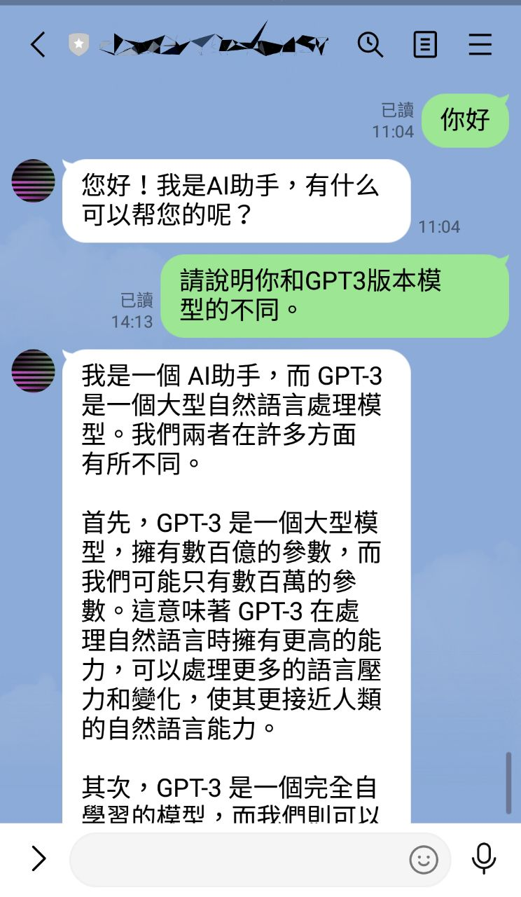
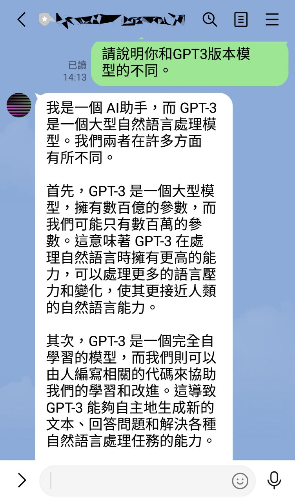

# Django-DALLE-linebot-Vercel
# 一個使用Django框架和DALLE，創造linebot的專案，快速建置於平台Vercel。

  

  

### [English](https://github.com/pyfbsdk59/Django-official-ChatGPT-linebot-Vercel/blob/main/README_en.md)
### [日本語](https://github.com/pyfbsdk59/Django-official-ChatGPT-linebot-Vercel/blob/main/README_jp.md)

### 1. 本專案參考了以下前輩和官方的方案改成製作，只針對剛學習Python或Django的朋友來佈置linebot在Vercel上。Vercel可取代取消免費方案的Heroku，來測試Side Project。

https://github.com/howarder3/GPT-Linebot-python-flask-on-vercel  
https://github.com/vercel/examples/tree/main/python/django

### 2. 本以為只要把Flask的部分改為Django部分即可，但花了兩天，遇到了許多坑。主要就是因為使用Django會超過Vercel Function的50MB限制，嘗試了許多版本終於成功。

### 3. 主要就是裝了openapi的依賴後容量會大增。故在這版本我們只使用Django 2.0版本減少容量。我試過Django 3.2以上版本會Build失敗。若沒有其他特別需求，建議使用Django 2.0版本即可。也歡迎測試其他版本。

### 4. openai的依賴必須使用0.27.0以上版本。
------
### Line和openai api設置請參考： https://github.com/howarder3/GPT-Linebot-python-flask-on-vercel
